# Guia de Treinamento Operacional

## Sistema de Gestão Comercial Uniseter

**Documento de treinamento interno**

**Versão:** 1.0  
**Data base:** 12/04/2026  
**Status:** Em preparação para versão ilustrada  
**Público-alvo:** Vendedores, Comercial Interno, Propostas, Jurídico e Administradores

---

## Controle do Documento

| Item | Informação |
|---|---|
| Documento | Guia de Treinamento Operacional |
| Sistema | Sistema de Gestão Comercial Uniseter |
| Objetivo | Padronizar a utilização do fluxo comercial e contratual |
| Formato atual | Texto estruturado para revisão |
| Próxima etapa | Complemento de prints finos e geração de PDF |

Versão visual pronta para diagramação:

- `docs/manual-treinamento-ilustrado.html`

---

## Sumário

1. Apresentação
2. Objetivo do sistema
3. Perfis de acesso
4. Visão do fluxo completo
5. Módulo de Solicitações
6. Módulo de Propostas
7. Módulo de Negociações
8. Módulo de Contratos
9. Dashboard e Funil de Vendas
10. Administração do sistema
11. Glossário consolidado
12. Glossário por módulo e por campo
13. Regras importantes do processo
14. Boas práticas de operação
15. Roteiro de treinamento por perfil
16. Roteiro de prints para a versão final

---

## 1. Apresentação

Este guia foi preparado para servir como material de treinamento e referência operacional do Sistema de Gestão Comercial Uniseter.

Ele foi pensado para:

- orientar usuários novos
- padronizar o preenchimento dos campos
- reduzir dúvidas de operação
- organizar o processo completo em uma única referência
- facilitar a futura geração de um manual em PDF com prints

---

## 2. Objetivo do Sistema

O sistema organiza o processo comercial desde a abertura da solicitação até a assinatura do contrato.

### O que o sistema controla

- entrada das solicitações comerciais
- triagem e análise interna
- elaboração e finalização de propostas
- geração do número da proposta
- envio ao vendedor
- andamento da negociação
- aceite comercial
- preparação contratual
- negociação de cláusulas
- contrato assinado

### Benefícios do uso correto

- melhor rastreabilidade do processo
- padronização do fluxo comercial
- histórico centralizado
- visibilidade por etapa
- controle por perfil
- acompanhamento por dashboard e funil

---

## 3. Perfis de Acesso

### Vendedor

Responsável por:

- abrir solicitações
- acompanhar os próprios negócios
- receber proposta
- registrar negociações
- atualizar probabilidade
- registrar aceite comercial

Regra importante:

- enxerga apenas os próprios negócios, inclusive no dashboard e no funil de vendas

### Comercial Interno

Responsável por:

- triagem da solicitação
- devolução para correção
- encaminhamento para elaboração da proposta

### Propostas

Responsável por:

- elaboração da proposta
- geração do número da proposta
- finalização da proposta
- envio ao vendedor

### Jurídico

Responsável por:

- elaboração contratual
- negociação de cláusulas
- registro do contrato assinado

### Administrador

Responsável por:

- visão total do sistema
- criação e manutenção de usuários
- configuração de listas e parâmetros

---

## 4. Visão do Fluxo Completo

### Sequência ideal do processo

1. Solicitação aberta pelo vendedor
2. Em triagem
3. Aguardando informações, se necessário
4. Em Elaboração da Proposta
5. Geração do número da proposta
6. Proposta finalizada
7. Recebimento de Proposta
8. Em negociação
9. Proposta Ganha
10. Elaboração de contrato
11. Negociação de cláusulas
12. Contrato assinado

### Observações críticas do fluxo

- o número da proposta deve ser gerado entre a elaboração e a finalização
- a proposta finalizada deve ter o PDF anexado antes do envio ao vendedor
- o resumo/diário da negociação deve ser alimentado com frequência
- o aceite comercial deve estar consistente com o que seguirá para contrato

---

## 5. Módulo de Solicitações

### Finalidade

Receber o pedido inicial do vendedor com todas as informações necessárias para a triagem e elaboração da proposta.

### Resultado esperado

Ao salvar, a solicitação deve entrar em `Em triagem`.

### Sequência recomendada de preenchimento

1. Dados da solicitação
2. Dados do cliente
3. Contatos
4. Tipos de serviço
5. Benefícios
6. Postos por serviço
7. Equipamentos por serviço
8. Observações gerais
9. Resumo antes do envio

### Checklist operacional do vendedor

- conferir razão social
- conferir e-mail de faturamento
- preencher cidade e estado
- definir pelo menos um tipo de serviço
- preencher postos e equipamentos de forma coerente
- revisar resumo antes de salvar

### Pontos de atenção

- `Segurança` e `Vigilância` representam a mesma linha operacional
- o campo de sábado considera apenas `entrada`
- os postos e equipamentos devem ser preenchidos por serviço para facilitar o orçamento

### Placeholder de print

`[PRINT - MÓDULO SOLICITAÇÕES]`

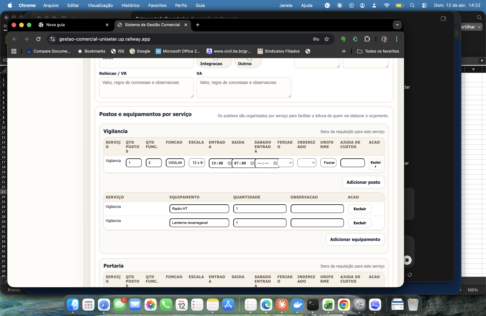

---

## 6. Módulo de Propostas

### Finalidade

Controlar toda a etapa interna de análise e preparação da proposta.

### Etapas do módulo

#### Em triagem

Usado para:

- validar a solicitação
- identificar pendências
- encaminhar para elaboração

#### Aguardando informações

Usado para:

- devolver a solicitação ao vendedor
- registrar a pendência
- controlar retorno para nova triagem

#### Em Elaboração da Proposta

Usado para:

- consolidar premissas
- preparar a proposta interna
- avançar até a geração do número

#### Geração do número da proposta

Usado para:

- formalizar o número oficial da proposta
- vincular o número à solicitação
- registrar dados da proposta no sistema

#### Proposta finalizada

Usado para:

- encerrar a preparação interna
- anexar o PDF final
- liberar para o vendedor

### Sequência recomendada

1. validar solicitação
2. encaminhar para elaboração
3. gerar número da proposta
4. finalizar proposta
5. anexar PDF
6. enviar ao vendedor

### Placeholder de print

`[PRINT - MÓDULO PROPOSTAS]`

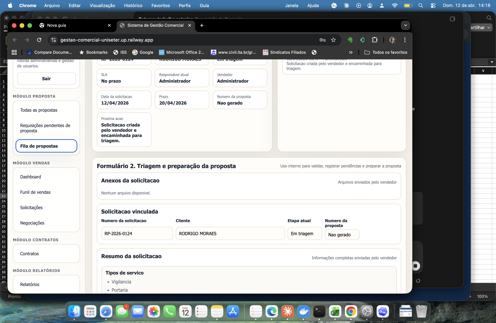

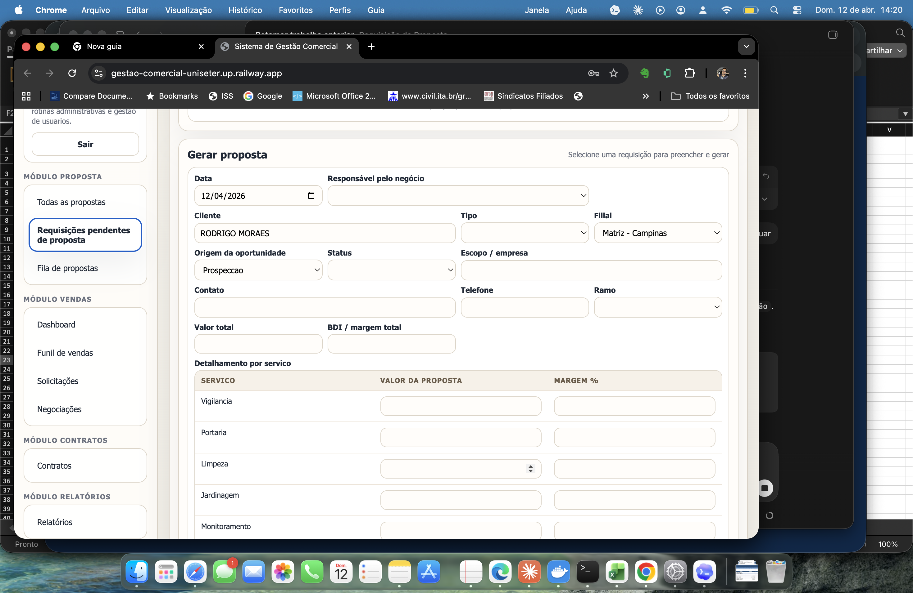

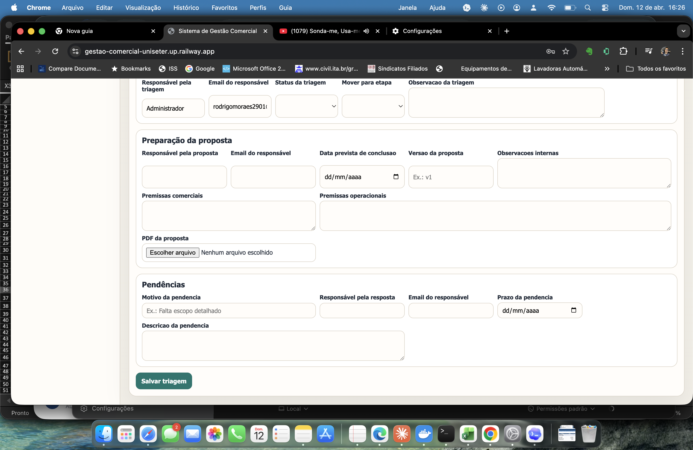

---

## 7. Módulo de Negociações

### Finalidade

Registrar a evolução da negociação após o recebimento da proposta pelo vendedor.

### O que deve ser atualizado pelo vendedor

- confirmação de recebimento
- status da negociação
- último contato
- próxima ação
- fechamento previsto
- observações comerciais
- resumo da negociação
- probabilidade
- motivo da probabilidade
- aceite comercial, quando houver

### Diário de negociação

O diário deve refletir, por data, as interações feitas com o cliente.

### Boas práticas do registro

- escrever o que foi discutido
- indicar o próximo passo
- atualizar a probabilidade quando houver mudança
- usar texto objetivo e útil para gestão

### Placeholder de print

`[PRINT - MÓDULO NEGOCIAÇÕES]`

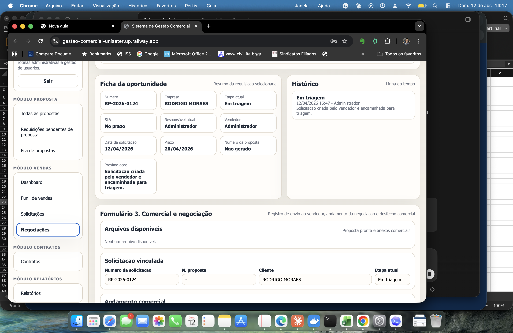

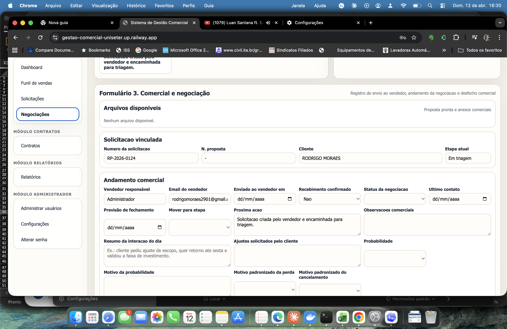

---

## 8. Módulo de Contratos

### Finalidade

Controlar a formalização do negócio após o aceite comercial.

### Etapas do módulo

#### Elaboração de contrato

Registra:

- início da preparação contratual
- responsável do contrato
- versão da minuta
- minuta inicial

#### Negociação de cláusulas

Registra:

- cláusulas em discussão
- rodada contratual
- pendências documentais
- observações jurídicas

#### Contrato assinado

Registra:

- data de assinatura
- anexo do contrato assinado
- etapa final do fluxo

### Placeholder de print

`[PRINT - MÓDULO CONTRATOS]`

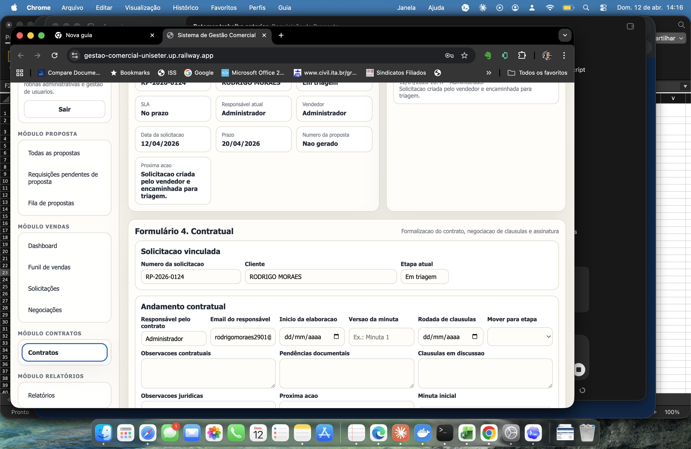

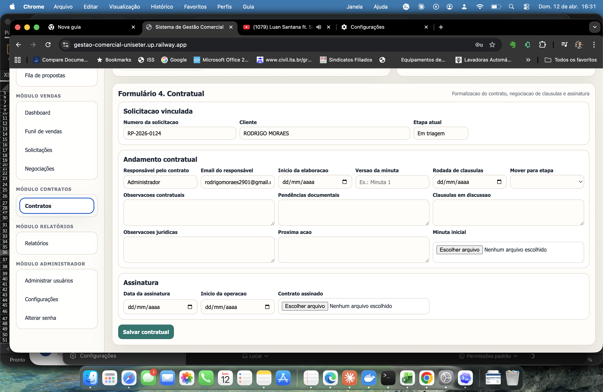

---

## 9. Dashboard e Funil de Vendas

### Finalidade

Entregar visibilidade operacional e gerencial da carteira comercial.

### Dashboard

Permite acompanhar:

- solicitações abertas
- itens no prazo
- itens em risco
- itens vencidos
- propostas ganhas
- contratos assinados

### Funil de Vendas

Permite acompanhar:

- pipeline ativo
- probabilidade
- volume
- entradas por mês
- ganhos por mês
- taxa de conversão
- visão por vendedor

### Regra de visibilidade

- vendedores enxergam apenas os próprios números
- perfis internos e gestão enxergam conforme suas permissões

### Placeholder de print

`[PRINT - DASHBOARD E FUNIL]`

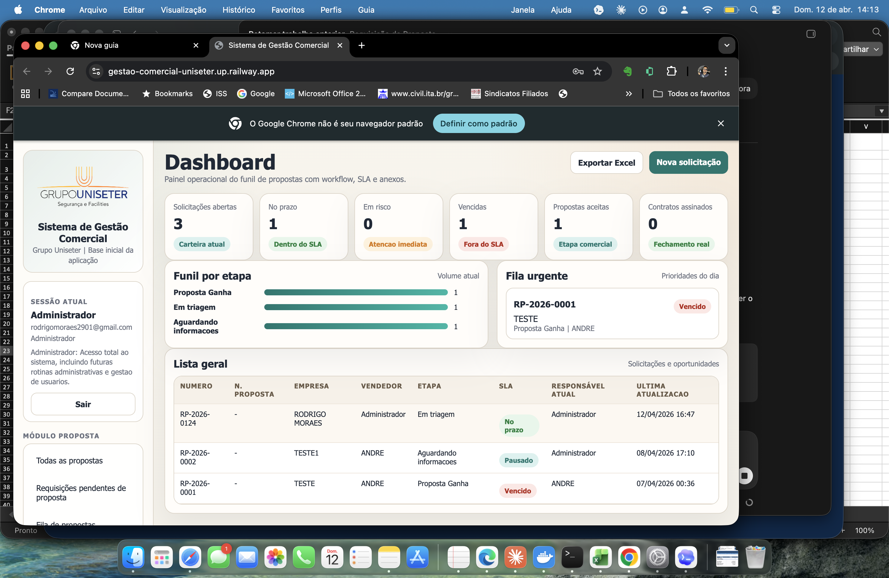

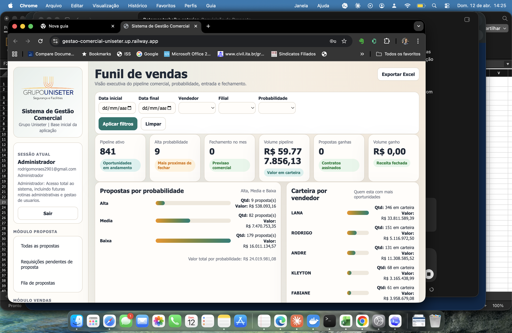

---

## 10. Administração do Sistema

### Finalidade

Concentrar os controles estruturais do sistema.

### Usuários

Permite:

- criar usuário
- definir perfil
- ajustar módulos liberados
- ajustar etapas liberadas
- redefinir senha
- desativar usuário

### Configurações

Permite manter listas como:

- filiais
- responsáveis
- origem do lead
- status da proposta
- tipos de documento
- segmentos
- tipos de serviço
- escalas
- equipamentos por serviço
- motivos de perda
- motivos de cancelamento

### Placeholder de print

`[PRINT - ADMINISTRAÇÃO]`

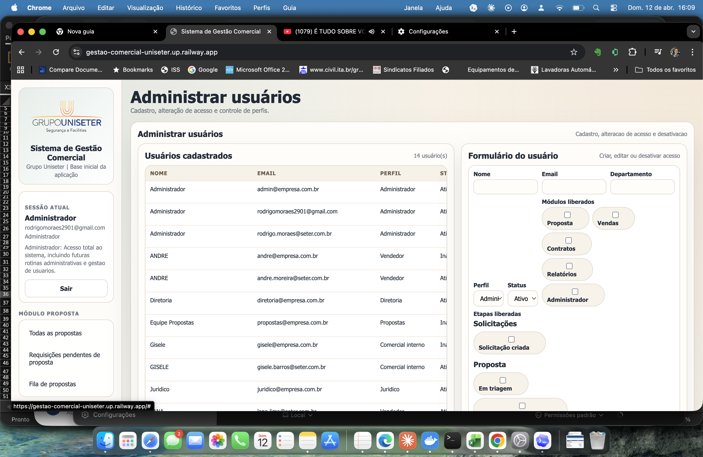

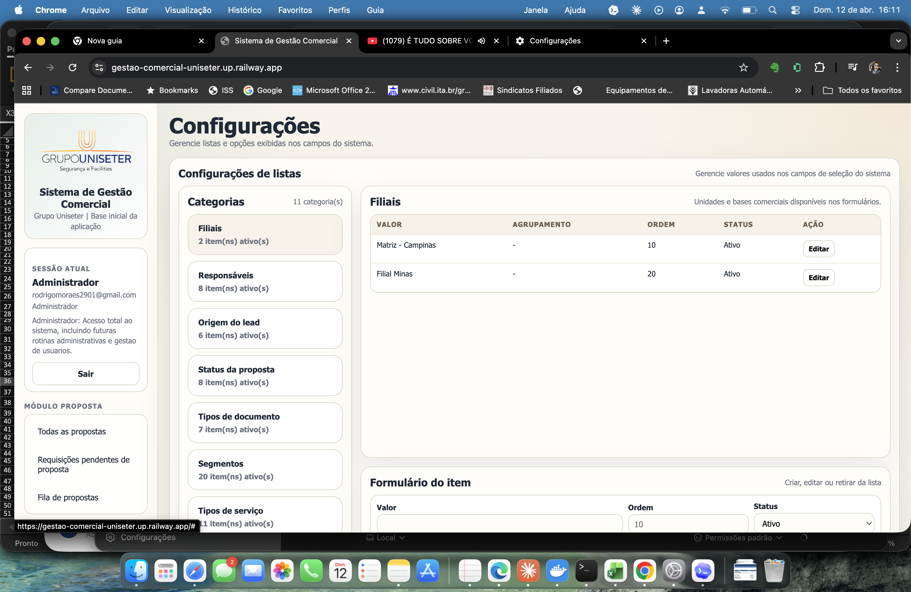

---

## 11. Glossário Consolidado

### Campos mais relevantes por processo

| Campo | Objetivo |
|---|---|
| Prazo de entrega | Define a expectativa de atendimento da solicitação |
| E-mail de faturamento | Centraliza o contato financeiro do cliente |
| Tipos de serviço | Define o escopo principal do negócio |
| Postos | Estrutura a operação humana do serviço |
| Equipamentos | Estrutura os recursos físicos do serviço |
| Nota da triagem | Resume a análise interna da solicitação |
| Número da proposta | Formaliza a proposta no sistema |
| PDF final da proposta | Documento final entregue ao vendedor |
| Resumo da negociação | Histórico objetivo das tratativas comerciais |
| Probabilidade | Indica chance de fechamento |
| Escopo aceito | Registra o que o cliente aprovou |
| Minuta inicial | Documento de início da etapa contratual |
| Contrato assinado | Documento final da formalização |

---

## 12. Glossário por Módulo e por Campo

### 12.1 Solicitações

#### Dados da solicitação

| Campo | Para que serve | Quem preenche | Observação prática |
|---|---|---|---|
| Data da solicitação | Registrar quando a requisição foi aberta | Vendedor | Ajuda no acompanhamento do prazo e SLA |
| Prazo de entrega | Informar a expectativa de devolutiva da proposta | Vendedor | Deve refletir a urgência real do cliente |
| Vendedor responsável | Identificar o dono comercial da oportunidade | Vendedor / sistema | Define visibilidade do negócio |
| Email do vendedor | Vincular o negócio ao usuário comercial | Vendedor / sistema | Usado para rastreabilidade e notificações futuras |
| Unidade / filial | Informar a base comercial vinculada ao negócio | Vendedor | Importante para gestão e relatórios |
| Origem da oportunidade | Registrar de onde veio o lead | Vendedor | Alimenta análises comerciais |
| Observação inicial da demanda | Resumir o pedido inicial do cliente | Vendedor | Deve explicar o contexto do pedido |
| Observações da correção realizada | Registrar o que foi ajustado quando a solicitação volta da triagem | Vendedor | Usado apenas em devoluções para correção |

#### Dados cadastrais do cliente

| Campo | Para que serve | Quem preenche | Observação prática |
|---|---|---|---|
| Razão social | Identificar o nome jurídico do cliente | Vendedor | Deve seguir o cadastro formal |
| Nome fantasia | Identificar o nome comercial usado no dia a dia | Vendedor | Facilita leitura operacional |
| CNPJ | Registrar o documento fiscal do cliente | Vendedor | Fundamental para proposta e contrato |
| Segmento | Classificar o ramo do cliente | Vendedor | Alimenta análises e filtros |
| Email de faturamento | Centralizar o contato financeiro do cliente | Vendedor | Campo importante para etapas posteriores |
| Endereço | Informar local principal da operação | Vendedor | Pode ser apoiado por CEP |
| Número | Complementar o endereço do cliente | Vendedor | Usar o número físico do local |
| Complemento | Detalhar torre, bloco, sala ou referência | Vendedor | Preencher quando necessário |
| Bairro | Localização complementar do endereço | Vendedor | Ajuda na conferência |
| Cidade | Município da operação | Vendedor | Importante para logística e custo |
| Estado | UF da operação | Vendedor | Importante para documentos e filtros |
| CEP | Apoiar localização automática e conferência do endereço | Vendedor | Serve como base para busca do endereço |

#### Contatos do cliente

| Campo | Para que serve | Quem preenche | Observação prática |
|---|---|---|---|
| Contato principal | Identificar a pessoa de referência do cliente | Vendedor | Priorizar quem conduz a negociação |
| Cargo | Informar a função do contato principal | Vendedor | Ajuda a qualificar o decisor |
| Email | Registrar canal formal do contato | Vendedor | Preferir e-mail corporativo |
| Telefone | Registrar contato rápido com o cliente | Vendedor | Útil para retorno operacional |
| Contato secundário | Registrar apoio ou substituto no cliente | Vendedor | Útil quando há mais de um envolvido |
| Cargo | Informar a função do contato secundário | Vendedor | Complementa o contexto do relacionamento |
| Email | Registrar o e-mail do contato secundário | Vendedor | Usar quando houver participação ativa |
| Telefone | Registrar telefone do contato secundário | Vendedor | Útil para contingência |

#### Operação, benefícios e anexos

| Campo | Para que serve | Quem preenche | Observação prática |
|---|---|---|---|
| Tipos de serviço | Definir o escopo principal da oportunidade | Vendedor | É a base para postos e equipamentos |
| VT região / dia | Informar referência de vale-transporte | Vendedor | Impacta cálculo de custo |
| Vale transporte | Informar regra de condução | Vendedor | Selecionar conforme política aplicável |
| Obs. VT | Registrar exceções do transporte | Vendedor | Usar quando houver regra fora do padrão |
| Assistência médica | Registrar política ou custo do benefício | Vendedor | Importante para orçamento |
| Refeição / VR | Informar valor e regra do benefício | Vendedor | Impacta composição do custo |
| VA | Informar valor e regra de alimentação | Vendedor | Complementa o pacote de benefícios |
| Postos e equipamentos por serviço | Estruturar operação humana e recursos por serviço | Vendedor | Deve ser preenchido por serviço, não de forma genérica |
| Observações gerais | Registrar informações adicionais da operação | Vendedor | Campo livre para contexto relevante |
| Anexos iniciais | Enviar documentos base recebidos do cliente | Vendedor | Ex.: escopo, memorial, descritivo |
| Documentos técnicos do cliente | Anexar arquivos técnicos para orçamento | Vendedor | Ex.: plantas, exigências e materiais técnicos |
| Obs. documentos técnicos | Explicar o conteúdo dos anexos técnicos | Vendedor | Ajuda quem vai elaborar a proposta |

### 12.2 Propostas

#### Solicitação vinculada e triagem

| Campo | Para que serve | Quem preenche | Observação prática |
|---|---|---|---|
| Número da solicitação | Identificar a requisição base da proposta | Comercial interno / sistema | Campo de referência |
| Cliente | Confirmar empresa vinculada | Comercial interno / sistema | Deve bater com a solicitação |
| Etapa atual | Mostrar o estágio atual do processo | Sistema | Usado para orientação |
| Número da proposta | Mostrar se o número já foi gerado | Sistema / propostas | Deve existir antes da finalização |
| Responsável pela triagem | Identificar quem está analisando a solicitação | Comercial interno | Define a responsabilidade da etapa |
| Email do responsável | Registrar contato do analista | Comercial interno | Facilita rastreabilidade |
| Status da triagem | Classificar o resultado da análise | Comercial interno | Ex.: em triagem, aprovada, com pendência |
| Mover para etapa | Definir para qual fase a solicitação seguirá | Comercial interno / propostas | Campo crítico do workflow |
| Observação da triagem | Registrar conclusão ou pendência encontrada | Comercial interno | Deve explicar a decisão tomada |

#### Preparação da proposta e pendências

| Campo | Para que serve | Quem preenche | Observação prática |
|---|---|---|---|
| Responsável pela proposta | Identificar quem vai elaborar a proposta | Propostas | Define dono da execução |
| Email do responsável | Registrar contato do elaborador | Propostas | Apoia rastreabilidade |
| Data prevista de conclusão | Informar previsão de entrega interna | Propostas | Importante para gestão do prazo |
| Versão da proposta | Controlar revisões do documento | Propostas | Ex.: v1, v2, revisão final |
| Observações internas | Registrar notas de uso interno | Propostas | Não é texto para o cliente |
| Premissas comerciais | Consolidar bases comerciais da proposta | Propostas | Ex.: condição, escopo, regra de preço |
| Premissas operacionais | Consolidar bases operacionais do orçamento | Propostas | Ex.: jornada, cobertura, recursos |
| PDF da proposta | Anexar o documento final que será enviado | Propostas | Obrigatório para envio ao vendedor |
| Motivo da pendência | Explicar o que falta para seguir | Comercial interno / propostas | Usado quando a requisição volta |
| Responsável pela resposta | Identificar quem precisa responder a pendência | Comercial interno / propostas | Pode ser vendedor ou outro responsável |
| Email do responsável | Registrar contato do responsável pela resposta | Comercial interno / propostas | Apoia acompanhamento |
| Prazo da pendência | Definir data limite de retorno | Comercial interno / propostas | Importante para não travar o fluxo |
| Descrição da pendência | Detalhar o ajuste necessário | Comercial interno / propostas | Deve ser objetiva e acionável |

### 12.3 Negociações

#### Andamento comercial

| Campo | Para que serve | Quem preenche | Observação prática |
|---|---|---|---|
| Número da solicitação | Identificar o negócio em negociação | Sistema | Campo de referência |
| N. proposta | Exibir a proposta vinculada | Sistema | Ajuda conferência comercial |
| Cliente | Confirmar a conta em negociação | Sistema | Referência visual |
| Etapa atual | Mostrar em que fase comercial o negócio está | Sistema | Apoia a tomada de ação |
| Vendedor responsável | Identificar dono da negociação | Vendedor | Campo central da carteira |
| Email do vendedor | Relacionar o negócio ao usuário | Vendedor / sistema | Apoia rastreabilidade |
| Enviado ao vendedor em | Registrar a data de recebimento da proposta | Vendedor / sistema | Marca início da fase comercial |
| Recebimento confirmado | Confirmar se o material chegou ao vendedor | Vendedor | Pode ser não ou sim |
| Status da negociação | Classificar o momento comercial | Vendedor | Ex.: recebimento, em negociação, proposta ganha |
| Último contato | Registrar a data da última interação | Vendedor | Mantém o histórico atualizado |
| Previsão de fechamento | Informar expectativa de avanço | Vendedor | Ajuda na visão do funil |
| Mover para etapa | Avançar ou reclassificar a negociação | Vendedor | Campo que altera o estágio |
| Próxima ação | Registrar o próximo passo combinado | Vendedor | Deve ser prática e objetiva |
| Observações comerciais | Registrar comentários amplos sobre a negociação | Vendedor | Campo complementar |
| Resumo da interação do dia | Criar o diário de negociação por data | Vendedor | Deve registrar o que aconteceu no contato mais recente |
| Ajustes solicitados pelo cliente | Consolidar pedidos de mudança | Vendedor | Muito útil para retorno a propostas |
| Probabilidade | Informar chance de fechamento | Vendedor | Alimenta dashboard e funil |
| Motivo da probabilidade | Justificar a chance atribuída | Vendedor | Deve explicar por que está alta, média ou baixa |
| Motivo padronizado da perda | Classificar a perda quando ocorrer | Vendedor | Obrigatório em negócios perdidos |
| Motivo padronizado do cancelamento | Classificar cancelamentos | Vendedor | Obrigatório em cancelamentos |

#### Desfecho comercial

| Campo | Para que serve | Quem preenche | Observação prática |
|---|---|---|---|
| Data do aceite | Registrar quando o cliente aprovou | Vendedor | Marca transição para contrato |
| Escopo aceito | Consolidar o que foi efetivamente aprovado | Vendedor | Deve refletir o combinado final |
| Condições aceitas | Registrar condições comerciais aprovadas | Vendedor | Ex.: prazo, reajuste, vigência |
| Observação do aceite | Complementar o contexto do aceite | Vendedor | Usar para observações relevantes |
| Anexo do aceite | Juntar evidência formal do aceite | Vendedor | Ex.: e-mail, termo, arquivo assinado |

### 12.4 Contratos

#### Andamento contratual

| Campo | Para que serve | Quem preenche | Observação prática |
|---|---|---|---|
| Número da solicitação | Identificar o negócio na etapa contratual | Sistema | Campo de referência |
| Cliente | Confirmar a empresa vinculada | Sistema | Deve bater com proposta e solicitação |
| Etapa atual | Mostrar fase contratual em andamento | Sistema | Ex.: elaboração, cláusulas, assinado |
| Responsável pelo contrato | Identificar o dono da etapa jurídica | Jurídico / administrativo | Define responsabilidade |
| Email do responsável | Registrar contato do responsável | Jurídico / administrativo | Apoia rastreabilidade |
| Início da elaboração | Marcar quando o contrato começou a ser preparado | Jurídico | Início formal da etapa |
| Versão da minuta | Controlar revisões da minuta | Jurídico | Ex.: minuta 1, minuta 2 |
| Rodada de cláusulas | Registrar a data da rodada de negociação | Jurídico | Ajuda no histórico da negociação |
| Mover para etapa | Definir avanço entre elaboração, cláusulas e assinatura | Jurídico | Campo principal do workflow contratual |
| Observações contratuais | Registrar notas gerais da etapa | Jurídico | Campo livre de apoio |
| Pendências documentais | Registrar documentos ainda faltantes | Jurídico | Importante para travas do processo |
| Cláusulas em discussão | Listar cláusulas sob negociação | Jurídico | Deve ser objetivo e claro |
| Observações jurídicas | Registrar análise e posicionamento jurídico | Jurídico | Serve como memória da etapa |
| Próxima ação | Registrar o próximo passo contratual | Jurídico | Ex.: enviar nova minuta |
| Minuta inicial | Anexar o primeiro documento contratual | Jurídico | Serve de base da negociação |

#### Assinatura

| Campo | Para que serve | Quem preenche | Observação prática |
|---|---|---|---|
| Data da assinatura | Registrar quando o contrato foi assinado | Jurídico / administrativo | Marca o fechamento documental |
| Início da operação | Registrar quando a operação passa a valer | Jurídico / operação | Importante para transição operacional |
| Contrato assinado | Anexar o documento final assinado | Jurídico / administrativo | É o encerramento formal da etapa |

### 12.5 Administração

#### Usuários

| Campo | Para que serve | Quem preenche | Observação prática |
|---|---|---|---|
| Nome | Identificar o usuário no sistema | Administrador | Usar nome reconhecível pela operação |
| Email | Definir login e vínculo do usuário | Administrador | Deve ser único |
| Departamento | Classificar área do usuário | Administrador | Facilita gestão interna |
| Perfil | Definir o tipo de acesso do usuário | Administrador | Ex.: vendedor, propostas, jurídico |
| Status | Ativar ou desativar o acesso | Administrador | Usuário inativo não deve operar |
| Módulos liberados | Definir quais áreas o usuário pode acessar | Administrador | Controla escopo de navegação |
| Etapas liberadas | Definir em quais fases o usuário pode atuar | Administrador | Complementa o perfil |
| Senha | Criar senha provisória de acesso | Administrador | Ideal para primeiro acesso ou reset |

#### Configurações de listas

| Campo | Para que serve | Quem preenche | Observação prática |
|---|---|---|---|
| Valor | Nome do item da lista | Administrador | Ex.: filial, segmento, motivo |
| Agrupamento | Organizar itens por categoria interna | Administrador | Usar quando fizer sentido na lista |
| Ordem | Definir posição de exibição | Administrador | Melhora usabilidade |
| Status | Ativar ou retirar item de uso | Administrador | Evita apagar histórico antigo |

### 12.6 Dashboard e Funil de Vendas

#### Filtros do funil

| Campo | Para que serve | Quem preenche | Observação prática |
|---|---|---|---|
| Data inicial | Definir o começo do período analisado | Gestão / usuários autorizados | Usar para recorte temporal do pipeline |
| Data final | Definir o fim do período analisado | Gestão / usuários autorizados | Deve fechar a janela de análise |
| Vendedor | Filtrar carteira por responsável comercial | Gestão / usuários autorizados | Vendedor só deve ver a própria carteira |
| Filial | Filtrar resultados por unidade comercial | Gestão / usuários autorizados | Útil para comparação entre bases |
| Probabilidade | Filtrar oportunidades por chance de fechamento | Gestão / usuários autorizados | Facilita leitura de pipeline por risco |

#### Indicadores e visões do funil

| Campo | Para que serve | Quem consulta | Observação prática |
|---|---|---|---|
| Propostas por probabilidade | Mostrar volume e valor por chance de fechamento | Gestão / comercial | Ajuda priorização |
| Carteira por vendedor | Mostrar distribuição das oportunidades | Gestão / comercial | Apoia acompanhamento da equipe |
| Entradas por mês | Mostrar demanda que entrou no CRM | Gestão | Mede geração de pipeline |
| Fechamentos por mês | Mostrar contratos assinados no período | Gestão | Mede resultado realizado |
| Etapas do funil | Mostrar volume por fase comercial | Gestão / comercial | Ajuda a localizar gargalos |
| O que está para fechar | Destacar oportunidades com alta chance | Gestão / comercial | Prioriza acompanhamento |
| Perdas por motivo | Mostrar causas de perda | Gestão | Apoia melhoria comercial |
| Conversão por vendedor | Mostrar entrada, aceite e fechamento por pessoa | Gestão | Mede efetividade comercial |
| Cancelamentos por motivo | Mostrar causas de cancelamento | Gestão | Ajuda no aprendizado do processo |
| Ticket médio por vendedor | Mostrar valor médio da carteira | Gestão | Apoia visão de mix e valor |

### 12.7 Módulo de Número da Proposta

#### Consulta do histórico

| Campo | Para que serve | Quem preenche/usa | Observação prática |
|---|---|---|---|
| Número / cliente / solicitação | Buscar registros específicos no histórico | Propostas / administração | Aceita número, cliente ou RP |
| Responsável pelo negócio | Filtrar propostas por gestor comercial | Propostas / gestão | Útil para carteira individual |
| Status | Filtrar situação do número de proposta | Propostas / gestão | Ex.: gerado, em uso, vinculado |
| Etapa | Filtrar pelo estágio do negócio | Propostas / gestão | Cruza histórico com workflow |
| Filial | Filtrar por unidade comercial | Propostas / gestão | Útil para visão regional |

#### Geração da proposta

| Campo | Para que serve | Quem preenche | Observação prática |
|---|---|---|---|
| Data | Registrar a data de emissão do número | Propostas | Base temporal do registro |
| Responsável pelo negócio | Vincular a proposta ao dono comercial | Propostas | Deve refletir o responsável real |
| Cliente | Registrar empresa da proposta | Propostas | Deve bater com a solicitação |
| Tipo | Classificar o tipo documental gerado | Propostas | Ex.: proposta, revisão, aditivo |
| Filial | Vincular a unidade comercial | Propostas | Importante para gestão |
| Origem da oportunidade | Preservar origem do lead no registro | Propostas | Mantém coerência com CRM |
| Status | Classificar situação do número gerado | Propostas | Ex.: gerado, em uso, vinculado |
| Escopo / empresa | Resumir o objeto da proposta | Propostas | Deve ser claro e objetivo |
| Contato | Identificar interlocutor principal | Propostas | Facilita rastreabilidade |
| Telefone | Registrar contato do cliente | Propostas | Apoia retorno rápido |
| Ramo | Classificar segmento da empresa | Propostas | Apoia relatórios |
| Valor total | Registrar valor global da proposta | Propostas | Base para indicadores e histórico |
| BDI / margem total | Registrar margem consolidada | Propostas | Ajuda no acompanhamento financeiro |
| Detalhamento por serviço | Quebrar valor e margem por linha de serviço | Propostas | Importante para leitura analítica |
| Arquivo da proposta | Anexar documento associado ao número | Propostas | Pode ser PDF, planilha ou arquivo de apoio |
| Observações | Registrar notas do cadastro do número | Propostas | Campo livre para contexto |
| Solicitação vinculada | Mostrar a requisição ligada ao número | Sistema / propostas | Garante rastreabilidade |

### 12.8 Relatórios

#### Filtros operacionais

| Campo | Para que serve | Quem usa | Observação prática |
|---|---|---|---|
| Data inicial | Definir início do período do relatório | Gestão / administração | Base do recorte temporal |
| Data final | Definir fim do período do relatório | Gestão / administração | Fecha a janela analisada |
| Vendedor | Filtrar negócios por responsável | Gestão / administração | Útil para visão individual |
| Etapa | Filtrar por status do workflow | Gestão / administração | Ex.: triagem, negociação, contrato |
| SLA | Filtrar por situação de prazo | Gestão / administração | Ajuda a identificar risco |
| Cliente / número | Buscar registro específico | Gestão / administração | Aceita empresa ou número da oportunidade |

#### Saída do relatório

| Campo | Para que serve | Quem usa | Observação prática |
|---|---|---|---|
| Exportar Excel | Gerar planilha para análise externa | Gestão / administração | Ideal para fechamento e controles adicionais |

### 12.9 Alteração de Senha

| Campo | Para que serve | Quem preenche | Observação prática |
|---|---|---|---|
| Senha atual | Confirmar identidade do usuário logado | Próprio usuário | Necessária para segurança |
| Nova senha | Definir a nova credencial de acesso | Próprio usuário | Deve seguir padrão seguro |
| Confirmar nova senha | Evitar erro de digitação na nova senha | Próprio usuário | Deve ser igual ao campo anterior |

---

## 13. Regras Importantes do Processo

- O número da proposta é obrigatório antes da finalização da proposta.
- O vendedor deve ver apenas os próprios negócios.
- O dashboard e o funil devem seguir a mesma visibilidade do vendedor.
- O PDF final deve estar anexo antes do envio ao vendedor.
- O aceite deve estar registrado antes do avanço contratual.
- O contrato assinado deve encerrar o fluxo.

---

## 14. Boas Práticas de Operação

- revisar o resumo antes de salvar a solicitação
- preencher os campos com padronização
- registrar negociação com frequência
- usar o diário como histórico de tratativas
- manter listas administrativas atualizadas
- evitar criar informações duplicadas

---

## 15. Roteiro de Treinamento por Perfil

### Treinamento do vendedor

1. abrir solicitação
2. preencher cliente
3. preencher operação
4. gerar resumo
5. acompanhar retorno
6. receber proposta
7. registrar negociação
8. registrar proposta ganha

### Treinamento do comercial interno / propostas

1. triar solicitação
2. devolver para correção
3. encaminhar para elaboração
4. gerar número da proposta
5. finalizar proposta
6. enviar ao vendedor

### Treinamento do jurídico

1. iniciar contrato
2. negociar cláusulas
3. anexar contrato assinado

### Treinamento do administrador

1. criar usuário
2. ajustar permissões
3. manter listas configuráveis
4. revisar acessos por perfil

---

## 16. Roteiro de Prints para a Versão Final

### Prints recomendados por módulo

#### Solicitações

- tela completa
- dados do cliente
- postos e equipamentos
- resumo antes de salvar

#### Propostas

- fila de triagem
- tela de triagem
- elaboração da proposta
- geração do número da proposta
- finalização com PDF

#### Negociações

- recebimento de proposta
- tela de negociação
- probabilidade
- resumo/diário

#### Contratos

- elaboração de contrato
- negociação de cláusulas
- contrato assinado

#### Administração

- usuários
- configurações

Observação:

- a visão geral de `Administrar usuários` e `Configurações` já está registrada neste guia
- uma segunda rodada pode complementar com prints aproximados de criação de usuário e edição de itens de lista

### Sugestão de próximo passo

Depois dos prints capturados, a próxima etapa ideal é:

1. inserir as imagens neste guia
2. revisar o texto final com a operação
3. gerar PDF institucional
4. criar uma versão curta para treinamento rápido
